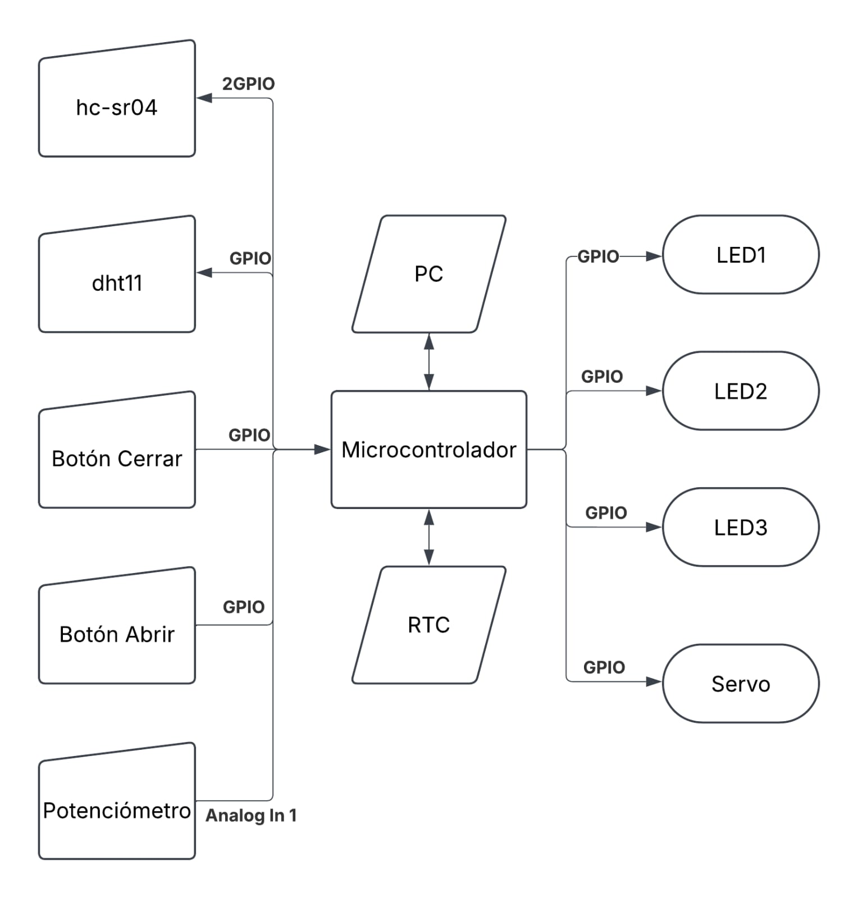

# TP_04

Título: Control de exposicion a radiacion. 

Alumno: Sebastián Andrada

Objetivo: Desarrollar un sistema que controle la temperatura, humedad y el angulo de exposicion de un objeto usando una interfaz de usuario de software y fisica.

Descripción: 

El sistema debe controlar a que tanta radiacion esta expuesto un dispositivo sin tocarlo (sin necesariamente medir la radiacion) y a cuanta temperatura y humedad esta expuesto. 

1 Seleccion del proyecto:
-

1.1 Criterios de seleccion:
-

Para hacerlo se propone, como minimo, tres proyectos que cumplan el objetivo, sean realizables y se diferencien por los siguientes criterios:

-Dificultad. (Que tan dificil es realizar el proyecto).
-Practicidad. (Que tanto sirve el proyecto).
-Interes. (Que tanto me intereza el proyecto).
-Automatizacion. (Que tanto se puede automatizar).
-Costo (Que tantos recursos me costaria realizarlo).

1.2 Posibles proyectos:
-
El primer proyecto posible es un sistema al cual se le ingrese la tasa de radiacion de la fuente, la distancia a la que esta del objeto a irradiar, la temperatura y la humedad objetivo, la cantidad de radiacion que se busque obtener y la velocidad de absorcion (angulo de exposicion a la fuente), cada valor tendria su forma paralela e individual de configurarlo. Todos estos valores se pueden mostrar y se podrian cambiar por la interfaz fisica y por la virtual.

Este proyecto es el más automatico, más practico, el que más me interesa pero a su vez es el que más cuesta y el más dificil de hacer.

El segundo proyecto es un sistema al cual se le ingrese la tasa, la distancia, la temperatura minima objetivo, la humedad minima objetivo y la radiacion absorbida minima/objetivo. Estos valores se pueden configurar individualmente de forma virtual y fisica, pero de esta ultima no de forma paralela. La cantidad de radiacion que se absorbe debe ser controlada por el usuario manualmente. Los datos se muestran completamente por software (menos la radiacion que es una estimacion). Fisicamente, solamente se muestra cuando se esta fuera del rango.

Este proyecto es un punto medio de todo y me interesa casi lo mismo con el primero.

El tercer proyecto es un sistema al cual se le puede configurar la tasa, la distancia, una temperatura minima, la radiacion absorbida minima y si esta en el rango de irradiacion o no. La humedad, la temperatura y la cantidad de radiacion absorbida (estimada).

Este proyecto es el que menos me cuesta, el más facil y es el que más bajo puntua en el resto.

1.3 Seleccion del proyecto:
-

Selecciono el segundo proyecto por que pienso que tiene el mejor costo/beneficio de los tres. 

1.4 Descripcion detallada del proyecto elegido:
-

2 Elcitación de requisitos y casos de uso:
-

Requisitos:
1. Exposición:
El sistema controlará la exposición a la fuente mediante un servo motor

2. Control de exposición:

El sistema controlará el grado de exposición con la distancia al sensor, si se selecciona este método. 

3. Temperatura:
El sistema controlará que la temperatura sea mayor que la pedida con un cooler apuntado hacia el sistema y una resistencia calefactora.

4. Humedad 
El sistema controlará que la humedad sea menor a la seleccionada con un cooler apuntando en contra del sistema.

5. Indicadores:
El sistema contará con indicadores para mostrar que se está configurando 
El sistema contará con indicadores para mostrar si  esta dentro de los rangos
6. Motor
El sistema contará con un motor para cambiar el grado de exposición
7. Calentar
El sistema contará con una resistencia calefctora para calentar.
8. Coolers
El sistema contará con un cooler apuntando al sistema para mandar el aire caliente.
El sistema contará con un cooler apuntando en contra al sistema para que funcione como extractor.
Ambos coolers no podrán funcionar al mismo tiempo.
9. Comunicación Bluetooth:
El sistema se conectara a un celular mediante Bluetooth.
El celular podrá enviar comandos y recibir información.
El sistema mandara la información pedida y seguira los comando recibidos.
Cada vez que haya un cambio se mandara una actualización al celular.
10. Comunicación serie:
El sistema recibirá comandos y manda información por un puerto serie.
11. Aplicación:
La aplicación mostrará una curva estimada de radiacion absorbida.
La aplicación mostrará la tasa efectiva 
La aplicación mostrará todos los valores medios y configurados
La aplicación servirá para configurar cada aspecto posible del sistema.
12. Sensores:
El sistema contará con un sensor de distancia para la interfaz de usuario
El sistema contará con un sensor de temperatura y humedad
13. Botones:
El sistema contará con 2 botones para cambiar que se configura y otro botón para cambiar el estado de lo seleccionado

Caso 1:
Disparador:
El usuario quiere controlar el grado de exposicion del sistema manualmente y controlar lo demás de forma automatica
Caso 2:
Disparador:
El usuario quiere solamente ingresar los valores del sistema y que todo funcione solo.
Caso 3:
Disparador:
El usuario quiere controlar solamente un aspecto del sistema.

Mercado y requisitos:
Caso de uso 1:
El usuario controla todo de forma fisica.

Caso de uso 2:
El usuario controla todo de forma virtual.

Caso de uso 3:
Se controlan solamente variables seleccionadas.

El sistema debe controlar una ceradura midiendo a que distancia se enecuentra el objetivo, la temperatura y la humedad de donde se encuentre, cuando el sistema detecte que la distancia medida es menor a la configurada, la temperatura pasa cierto umbral definido por el usuario, baja de una temperatura fija minima o aumenta la humedad de un valor fijo maximo se abre la cerradura. Si esta dentro de los rangos se cierra. Para ello, se define con dos #define el valor maximo de humedad y la temeperatura minima. Se usan grados Celsius y centimetros.
El usuario puede abrir la cerradura independientemente de las concidiones pero solo puede cerrarla ignorando lo medido de forma fisica. Cuando se da el comando de abrir unicamente el comando de cerrar (ambos fisico o remoto) puede anular la orden. El sistema prioriza abrir la cerradura. El sistema puede ser configurado para mostrar la hora actual, aunque en esta etapa no es un requerimieto.

Para medir la temperatura y la humedad se usa el sensor dht11 que se puede encontrar aca:
[https://articulo.mercadolibre.com.ar/MLA-930151306-sensor-analogico-temperatura-lm35dz-lm35-55c-a-150c-_JM#polycard_client=search-nordic&position=9&search_layout=stack&type=item&tracking_id=ebca7547-7db6-4114-ad18-bfeb51baf674&wid=MLA930151306&sid=search](https://www.mercadolibre.com.ar/dht11-sensor-de-temperatura-humedad-dht-11-arduino/p/MLA32624358#polycard_client=search-nordic&searchVariation=MLA32624358&wid=MLA1666030296&position=3&search_layout=grid&type=product&tracking_id=6ec316c3-8e8f-4f5f-aa64-b72c598be1bb&sid=search)

Este sensor funciona usando una linea con un protocolo de comunicacion half-duplex. Para empezar la comunicacion se manda al sensor una señal especifica y se busca su respuesta. Si hay respuesta se verifica la misma y despues de eso se guardan los datos.

Si el usuario quiere cambiar el umbral del sistema se utiliza un potenciómetro.

El control fisico esta manejado por dos botones, uno si se presiona da el comando de abrir y el otro el de cerrar.

El estado de la cerradura se muestra con dos leds, uno se prende si esta abierta y el otro si esta cerrada.

La distancia se mide con el sensor hc-sr04 que se puede encontrar aca:
https://articulo.mercadolibre.com.ar/MLA-1394992860-arduino-hc-sr04-modulo-sensor-ultrasonico-5v-_JM?highlight=false&headerTopBrand=false#polycard_client=search-nordic&position=12&search_layout=grid&type=item&tracking_id=67394c92-79ac-4f1e-9bd5-6a61412d43d0&wid=MLA1394992860&sid=search

Este sensor funcioa usando dos lineas con un protocolo de comunicacion full-duplex real pero que practicamente es half-duplex ya que no se manda ni se recibe al mismo tiempo. Para realizar la medicion se manda una señal caracteristica como trigger y se espera su respuesta en la otra linea. Una vez que llega la misma como un 1 logico se empieza a contar el tiempo que se tarda en aparecer un 0 logico, despues usando una ecuacion se transforma el tiempo en distancia. Para esto se usan tres interrupciones, una de 100ms que se usa para empezar el ciclo del sensor y dos para cubrir los flancos ascendentes y descendentes del pin de ECHO.

Si el usuario quiere cambiar la distanca minima a la que debe acercarse para abrir la cerradura debe apretar los dos botones al mismo tiempo y elegir la señal, en este caso la puerta se abrira y se prendera un led, una vez que se suelten se apagara el led y la cerradura funcionara como siempre.

La cerradura se controla con un servo motor como el siguiente:
https://www.mercadolibre.com.ar/mini-servo-tower-pro-sg90-9g-robotica-arduino-servomotor/p/MLA46735454#polycard_client=search-nordic&searchVariation=MLA46735454&wid=MLA2029850566&position=2&search_layout=stack&type=product&tracking_idws=6c7b7a13-4f65-46b4-a9e5-7da6822a7150&sid=search 
Para controlarlo se pone un utiliza un pwm con 50Hz de frecuencia y se varia el ancho de pulso entre 1ms y 1,5ms. Estos valores equivalen a 0 y 180 grados, respectivamente. La cerradura estara abierta con el servo a 180 grados (1,5ms) y cerrada a 90 grados (1,25ms).

Al principio del programa se muestran los comandos disponibles.
- Ver el estado de la cerradura
- Ver el estado de los botones
- Ver el estado de los leds
- Ver la temperatura medida actual
- Ver la humedad medida actual
- Ver la distancia medida actual y el modo de lectura
- Ver los limites de temperatura, humedad y distancia
- Ver la fecha y hora actual (si esta configurada)
- Configurar la fecha y hora
- Abrir la cerradura
- Cerrar la cerradura
- Ver los comandos (si se toca algo diferente tambien se pueden ver)
- Mostrar el registro de todos los datos actuales

Cada vez que haya un cambio o se pida con un comando se envía a través del puerto serie el registro de todos los datos actuales:
- Estado de la cerradura
- Estado de los botones
- Estado de los leds
- Temperatura actual
- Humedad actual
- Distancia actual y modo de lectura
- Limites de temperatura, humedad y distancia
- Fecha y hora actual (si esta configurada)

Plataforma de desarrollo: NUCLEO-F429ZI

Periféricos a utilizar:

DIGITAL IN 1 (D2): Controla el que la cerradura se abra. 

DIGITAL IN 2 (D3): Controla que la cerradura se cierra.

DIGITAL IN - OUT (D4): Controla el sensor y recibe los datos.

DIGITAL IN 3 (D5): Controla el trigger del sensor de ultrasonido.

DIGITAL OUT (D6): Recibe la salida ECHO del sensor de ultrasonido.

LED 1: Si esta apagado solo mide distancia, si esta prendido mide distancia y su respectivo limite.

LED 2: Se enciende si la cerradura está cerrada.

LED 3: Se enciende si la cerradura está abierta.

PWM 1 (D7): Controla el servo.

ANALOG IN 1 (A0): Se utiliza para leer el umbral de temperatura

UART: Se utiliza para enviar información de estado del sistema

Diagrama en bloques del sistema:
 

Diagrama en bloques del programa:

Video del sistema funcionando:

